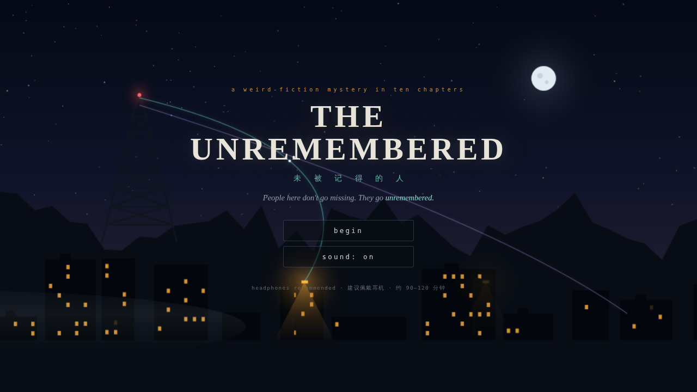
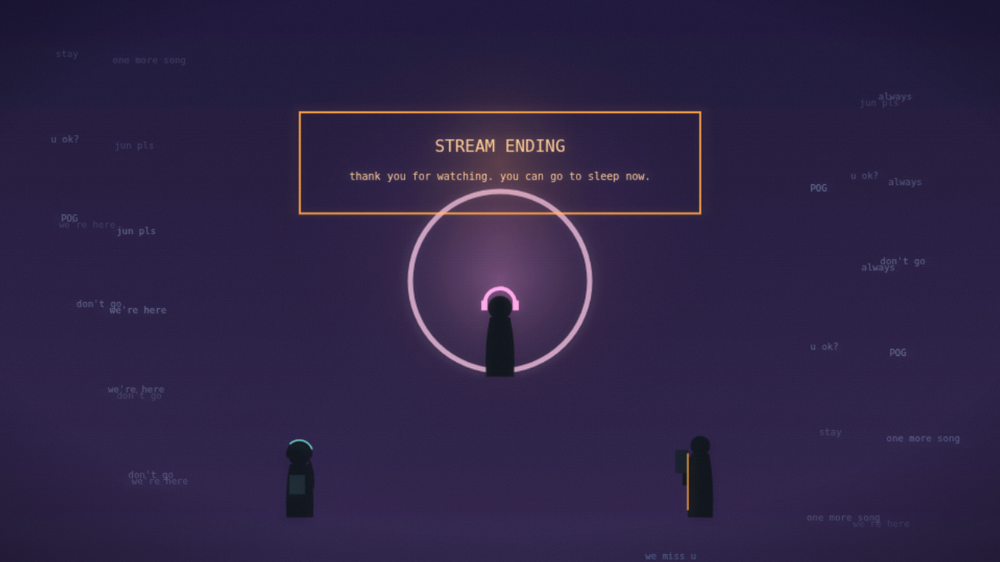
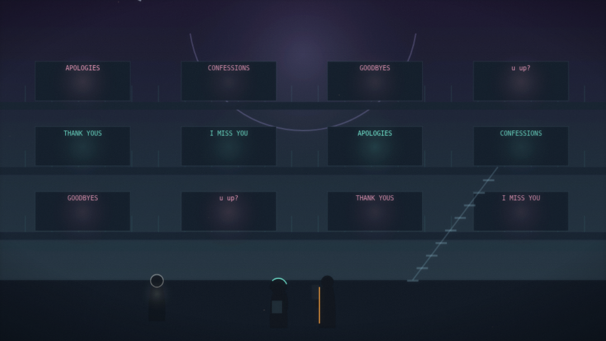
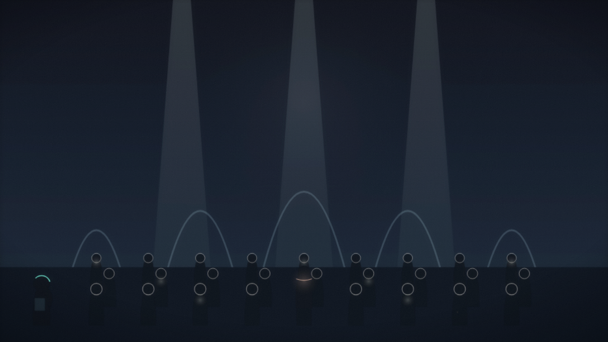
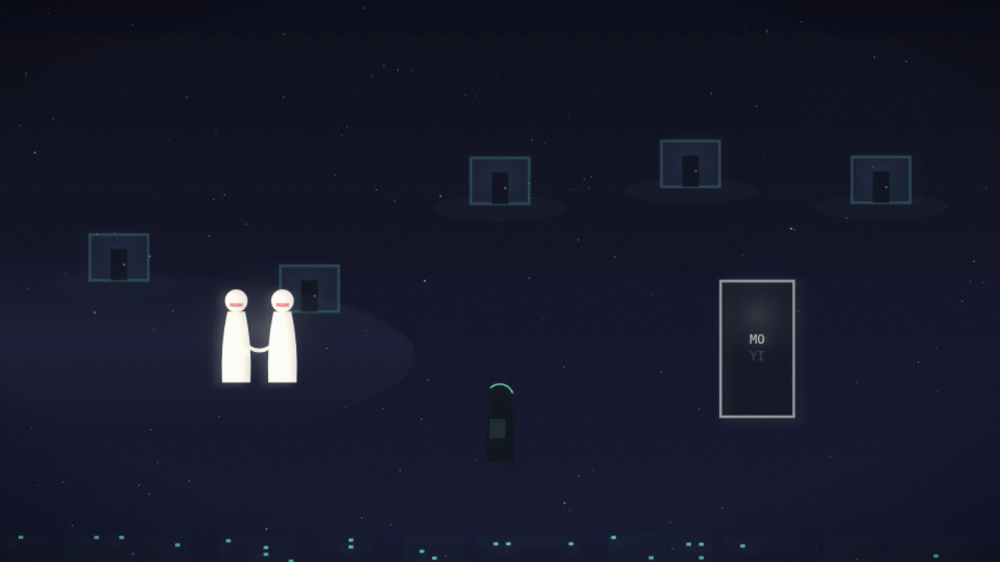
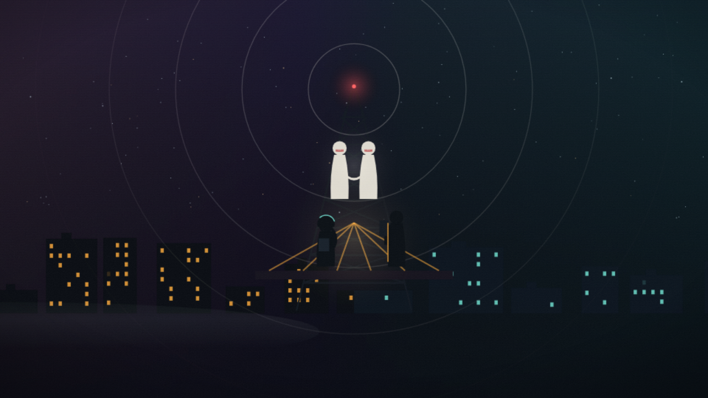

# THE UNREMEMBERED · 未被记得的人

> A weird-fiction mystery in ten chapters — a playable narrative game built from the
> [original design document](docs/DESIGN.md). Zero dependencies, runs in any modern browser.
>
> *People in Greyhollow don't go missing. They go **unremembered**.*

   

<table>
<tr>
<td></td>
<td></td>
</tr>
<tr>
<td></td>
<td></td>
</tr>
<tr>
<td></td>
<td></td>
</tr>
</table>

<sub>更多场景见 [docs/shots/](docs/shots/) — 全部画面为程序化 Canvas 实时绘制，零图片资源。</sub>

---

## ▶ 运行 · How to play

**No build step. No dependencies.**

```bash
# option 1 — any static server
cd THE-UNREMEMBERED
python3 -m http.server 8000
# open http://localhost:8000

# option 2 — just open the file
# double-click index.html (classic scripts: works from file://)
```

也可直接开启 GitHub Pages（Settings → Pages → branch 根目录），即可在线游玩。

**操作 Controls**

| 输入 | 作用 |
|---|---|
| 点击 / `Space` / `Enter` | 推进对话（打字中点击 = 立即显示全文）|
| 点击 + 按住 | 哼唱、蓄力、共鸣、**FEEL IT** |
| 指针移动 | 群飞体逃脱中的移动 |
| `Esc` | 暂停菜单（存档标题会在低清醒度时撒谎——这是特性，不是 bug）|

建议佩戴耳机。全部音乐为实时合成——摇篮曲动机会贯穿、退化、再以变形归来。

---

## 🕯 What this is

An interactive implementation of the full ten-chapter design: every system in the
document exists as a **playable mechanic**, not flavor text.

| 设计文档系统 | 游戏内实现 |
|---|---|
| **Lucidity（莫依）** | 真实资源。降到 40 以下：对话会闪现错词、HUD 漂移；第九章降到 0：菜单撒谎、存档标题变成 *"(Senna's Version)"*、目标自动"完成" |
| **Stability（帕里斯）** | 压抑状态下的每次建造都会累积 **隐藏裂缝（只有玩家看得见）**，第八章按建造顺序逐一引爆；第八章中段仪表被**从屏幕上移除** |
| **Resonance 共鸣** | 双主角对时玩法；第四章决裂期间机制性不可用——你会以"失去能力"的方式感到关系的缺席 |
| **Undelivereds 未寄出之物** | 既是钥匙、又是档案、又是道德货币；投递治愈帷幕（失去资源），囤积保留力量（喂养寂静）|
| **Memory-burning 燃忆** | 第五章唤醒空心者需烧掉你在 1-4 章获得的真实记忆——游戏数据真的随之遗忘（第九章的回忆谜题会因此改变）|
| **Hush 噤声** | 第七章起常驻的金色第四音域：永远有效；每次使用都会**永久抽走一部分配乐** |
| **冷开场可玩消逝** | 你以 Senna 的身份游玩：血条、小地图、暂停键、最后连**名字**从对话框里逐字蒸发 |
| **FEEL IT** | 终章最后一个交互：按住按钮听完整首闭幕之歌——包括难以聆听的部分。松手，歌会等你。制作名单在此之前不会滚动 |

**Branch-and-bottleneck**：每章固定戏剧节点收束，但情绪状态持续覆写后续——
母亲是否唤醒（代价是 Senna 的脸，永久模糊）、对 Senna 的三种请求、道歉被接受还是被吸收、
诚实之砖的数量、Hush 的使用次数——全部汇入第十章的**全程审计**：你的舞台由你真实的历史搭成。
没有失败结局，只有版本。两种结局都被写成真的。

---

## 🎨 Look & sound

- **Analog dusk**：钠灯橙、CRT 蓝绿、扫描线、胶片颗粒、暗角——程序化 Canvas 绘制，无任何图片资源
- **Soft-wrong（帷幕世界）**：色相偏移的双重曝光"呼吸边缘"、未寄出讯息如雪飘落、流言以鸟群算法（boids）猎你
- **Diegetic score**：WebAudio 全合成。商场永远播着保留音 hold-music；空心者合唱是完美齐唱（恐怖之处：没有和声，因为和声需要差异）；第九章帕里斯**跑调的**摇篮曲是把你拉回来的那只手

---

## 🗂 Structure

```
index.html              壳 + HUD/对话/面板 DOM
css/style.css           双世界视觉语言、CRT/颗粒、故障美学
js/core/
  util.js               帮手
  audio.js              合成器：动机、音域、场景音床、SFX
  state.js              持久情绪状态 / 燃忆 / 撒谎的存档标题
  paint.js              ~20 个程序化场景绘制器 + 人物剪影 + 软错后处理
  fx.js                 粒子（讯息之雪/灰烬）+ 群飞体 + 震屏
  hud.js                可被剥夺的界面 / 通知 / 暂停菜单（含第五个发光选项）
  mini.js               全部 17 种互动机制
  engine.js             节拍执行器 / 打字机 / 低清醒度文本腐蚀
js/data/ch01..ch10.js   十章完整剧本（数据驱动）
docs/DESIGN.md          原始叙事设计文档
test/                   Playwright 冒烟 + 全流程自动通关测试
```

**Save system**: localStorage 自动存档于每章末尾；章节选择随进度解锁。
低清醒度时，存档界面显示的标题不可信。数据本身是诚实的。界面不是。

---

## 🧪 Tests

```bash
python3 -m http.server 8321 &
npm i playwright && npx playwright install chromium
node test/smoke.mjs          # boot + opening + scene rendering, console-error gate
node test/walkthrough.mjs    # an auto-player that solves every minigame, ch1→10
```

---

*Tone rule, kept: the game never mocks coping mechanisms. The Quiet is persuasive
because numbness genuinely works in the short term. The horror is the interest rate.*
